# Dependency Graph

Per `AGENTS.md`, this diagram tracks **which Use Cases call which Feature
Facades**. Use Cases are the only place cross-feature coordination is allowed;
single-feature work is performed by an Action calling its Facade directly and
therefore does **not** appear as a Use Case node below.

```mermaid
graph TD
    subgraph "Use Cases (cross-feature orchestrators)"
        UC_cancelInvite[cancel-admin-invitation]
        UC_createSA[create-school-assistant]
        UC_createEvent[create-timesheet-event]
        UC_fetchInvite[fetch-invite-details]
        UC_getChildren[get-assigned-children]
        UC_inviteAdmin[invite-admin-user]
        UC_promote[promote-user-to-owner]
        UC_removeAdmin[remove-admin-user]
        UC_resendAdmin[resend-admin-invitation]
        UC_resendSA[resend-school-assistant-invitation]
    end

    subgraph "Feature Facades"
        F_children[ChildrenFacade]
        F_timesheet[TimesheetFacade]
        F_sa[SchoolAssistantsFacade]
        F_invitation[InvitationFacade]
        F_user[UserFacade]
    end

    UC_cancelInvite --> F_invitation
    UC_createSA --> F_invitation
    UC_createSA --> F_sa
    UC_createEvent --> F_children
    UC_createEvent --> F_timesheet
    UC_fetchInvite --> F_invitation
    UC_fetchInvite --> F_sa
    UC_getChildren --> F_children
    UC_getChildren --> F_timesheet
    UC_inviteAdmin --> F_invitation
    UC_inviteAdmin --> F_user
    UC_promote --> F_user
    UC_removeAdmin --> F_user
    UC_resendAdmin --> F_invitation
    UC_resendSA --> F_invitation
    UC_resendSA --> F_sa
```



## Single-feature flows (no Use Case)

These Actions call exactly one Facade and so, per the architecture rules, are
**not** Use Cases. They are listed here for completeness.

- **Handlungsbedarf dashboard** (COD-50) — `/admin/handlungsbedarf`.
  `getHandlungsbedarfAction` → `ChildrenFacade.getHandlungsbedarf()`. The facade
  loads all children (with assignments, Stundenplan, absences, Vertretungen)
  plus the week's `SICK`/`WORK` events from the children services, then runs the
  pure `detectHandlungsbedarf()` rules. The inline "Vertretung zuweisen" action
  reuses `createVertretungAction` / `updateVertretungAction` from the same
  feature.

  ```mermaid
  graph LR
      Page["/admin/handlungsbedarf (page + action)"] --> F_children[ChildrenFacade]
      F_children --> S_children[children/services]
  ```

  All required data lives in (or is reachable through) the `children` feature,
  so a cross-feature Use Case is intentionally avoided. The list of accepted
  Schulbegleiter for the assign combobox is fetched separately on the page via
  `SchoolAssistantsFacade.list()` (read-only options, not part of detection).
